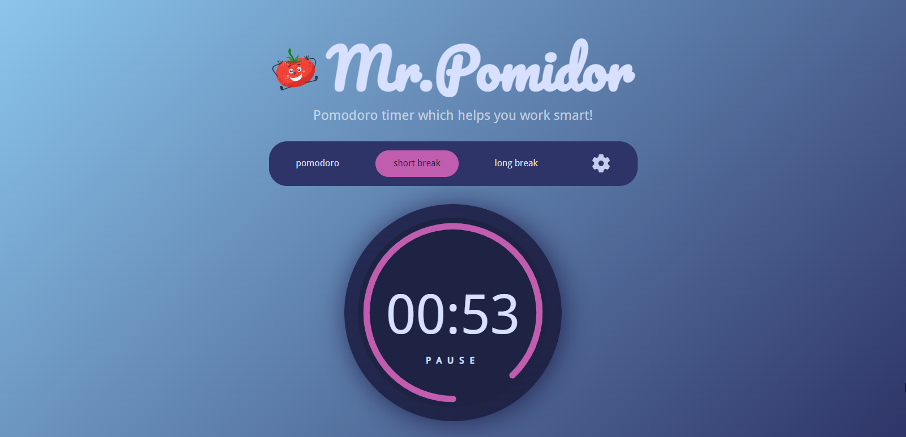

# getFrontend projects on Github.io

CSS generators:
* [Simple border-radius generator](https://getfrontend.github.io/app-sbrg.html) has no title attribute
* Triangle generator

## JS projects
* [Mr.Pomidor - useful and customizable Pomodoro timer!](https://getfrontend.github.io/app-pomidor/)

